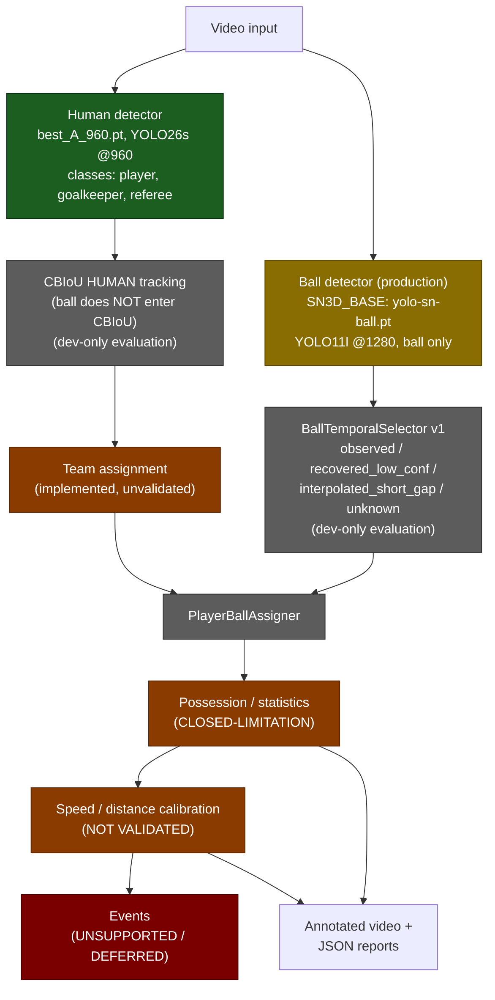

# EyeCU 4.0 — Pipeline Diagram

Architecture as documented in [README.md](README.md), annotated with final
validation status per component. This diagram is descriptive documentation
only — no code, model, or data changes are implied.

## Legend

| color | meaning |
|---|---|
| green | held-out (TEST) supported |
| gold | held-out supported but weak / materially variable (ball, inside detector) |
| grey | development evaluation only, no held-out validation |
| orange | implemented but unvalidated / closed-limitation |
| red | unsupported / deferred |

## Notes

- The system is two separate branches merging only at `PlayerBallAssigner`:
  a human branch (`best_A_960.pt` → CBIoU → team assignment) and a ball
  branch (`SN3D_BASE` / `yolo-sn-ball.pt` → BallTemporalSelector v1). The
  ball never enters CBIoU or team assignment.
- Production ball detection uses the separate SN3D_BASE YOLO11l ball
  branch, not EyeCU's own detector; it is supported by held-out evaluation
  but is the weakest and most variable class (see
  [FINAL_PROJECT_REPORT.md](FINAL_PROJECT_REPORT.md) §3, §8).
- Everything downstream of the two detectors (CBIoU, team assignment,
  BallTemporalSelector, PlayerBallAssigner, possession, calibration,
  events) has not been measured against held-out ground truth in this
  project — only frame-level detection has (§9 of the final report).

## Post-freeze note (NON-TEST development, does not change this diagram)

Two post-freeze corrections apply inside the `PlayerBallAssigner` box
without changing the architecture above: (1) a goalkeeper may now be
recorded as the ball possessor under the same geometry as a field player
(team-control credit stays unknown for them, never fabricated); (2) an
automatic guard to detect and split contaminated CBIoU tracklets was
evaluated but did **not** pass its adoption gate, so it was **not
integrated** — `CBIoU HUMAN tracking` in this diagram is exactly the raw,
unmodified production tracker. See `../provenance/POST_FREEZE_SYSTEM_PATCH.md`.
