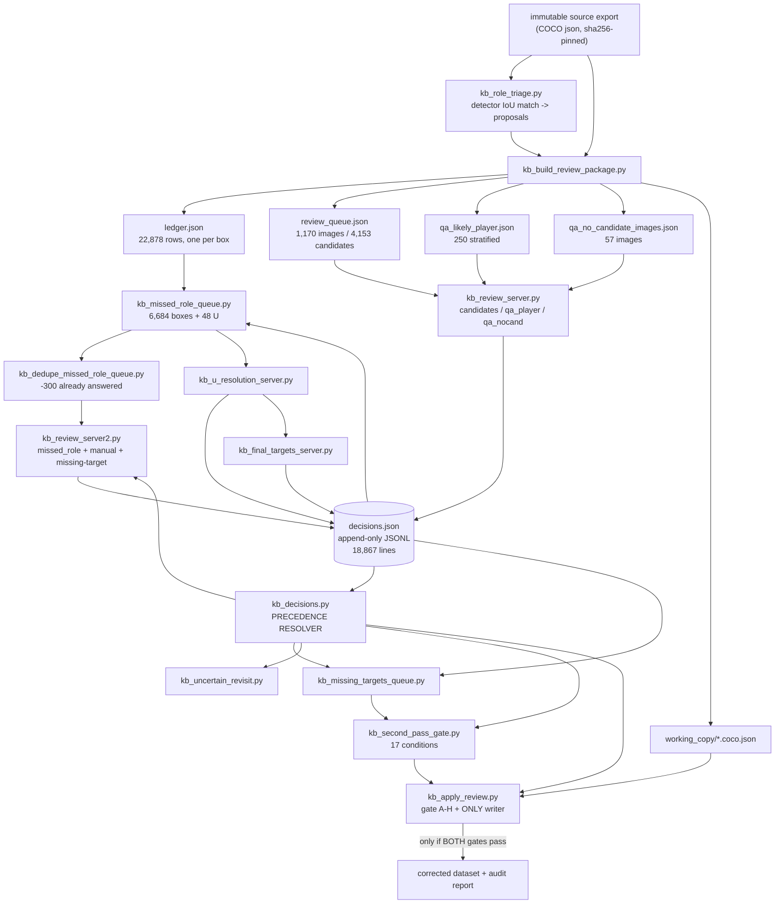
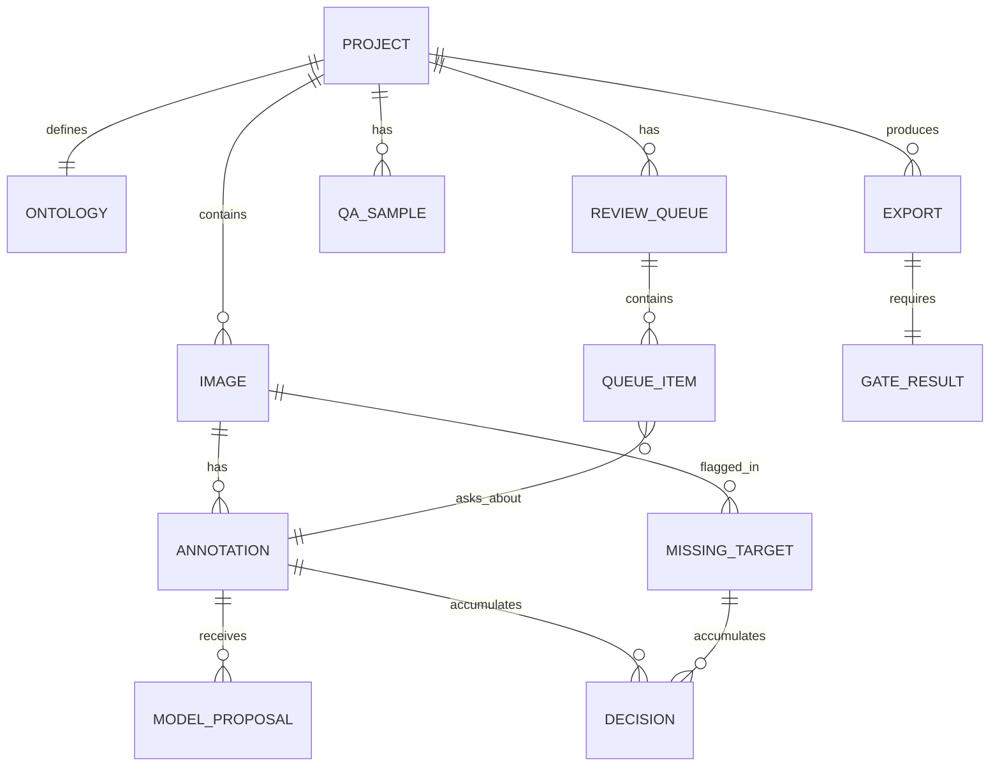

# AI-Assisted Dataset Review, Correction and Annotation QA — Blueprint

**Status:** specification only. Nothing here has been built. No repository has been
created, no EyeCU code has been moved, nothing has been deployed.

**Purpose:** capture, while it is still fresh, what was learned building a
human-in-the-loop dataset review system inside EyeCU 4.0, so that a future
developer or coding agent with **no access to the conversations that produced it**
can build the general-purpose product from a standing start.

**Written:** 2026-08-12, against EyeCU 4.0 branch `cleanup/local-detector`.

**How to read this:** sections 1–3 are the product argument. Sections 4–9 document
what actually exists in EyeCU today, with real numbers, and are the factual base.
Sections 10–14 are the generalised domain model. Section 15 is the failure
catalogue and is the single most valuable part of this document. Sections 16–26
are forward-looking design, explicitly speculative. Section 27 is the activation
checklist.

Anything describing EyeCU's current behaviour was verified against the code and
data on the date above. Anything describing the future product is a proposal and
is marked as such.

---

## 1. Why this product should exist

The tooling described here was not designed. It accreted, under pressure, because
a real dataset could not be used as it was and re-annotating it was not affordable.

The specific situation: EyeCU needed more small-ball and goalkeeper/referee
training data. A public dataset (keremberke football object detection, 22,878
boxes across 1,170+ images) had exactly the imagery required, but its ontology
collapsed goalkeeper and referee into `player`. EyeCU's four classes are
`player / goalkeeper / referee / ball`. Importing it as-is would have poisoned the
two classes the detector was already weakest on.

Three options existed:

1. Drop the dataset. Loses the only native-resolution source of tiny balls.
2. Re-annotate 21,615 human boxes from scratch. Not affordable.
3. **Have a model find the boxes whose class is probably wrong, and have a human
   review only those.**

Option 3 worked, and the review of 4,153 flagged candidates took hours instead of
weeks. But it also produced the finding that motivates the entire product:

> **Completing the candidate queue did not prove the dataset was fixed.**
>
> A stratified QA sample of 250 boxes the triage had labelled LIKELY_PLAYER found
> a **6.40% missed-role rate**. Extrapolated to the population of 17,462, roughly
> **1,118 officials (95% CI 588–1,647)** were still mislabelled `player` after the
> queue was 4,153/4,153 complete. Separately, **25 of 57** images where the triage
> flagged nothing at all contained a missed official.

That is the wedge. Any tool can show a human a list of model suggestions. The hard
and valuable part is answering:

> *"How confident are we that the review process did not simply fail to show the
> human the errors?"*

That question is what turns a review UI into a dataset QA product.

---

## 2. Product vision

**AI-assisted dataset review, correction and annotation QA.**

Not another general-purpose annotation tool. The wedge is narrow and specific:

```
A dataset already has annotations.
A model analyses it.
The system identifies likely mistakes, missing objects, wrong classes,
suspicious boxes and uncertain cases.
A human reviews the smallest possible subset instead of re-annotating everything.
```

Core promise:

```
Let the model find where a human should look.
Let the human remain the annotation authority.
```

Working tagline concept (not final branding): *Review less. Fix what matters.*

### What it is not

- Not a from-scratch annotation tool. It assumes annotations exist.
- Not a labelling marketplace.
- Not an auto-labeller. A model prediction never becomes ground truth by itself.
- Not football-specific (see §4).

---

## 3. The central product principle: complex engine, simple surface

EyeCU's tooling is powerful and completely unsuitable as a product UI. It was
built by and for the one person who held the whole model in their head. A new user
would immediately hit:

- nine review **modes** (`candidates`, `qa_player`, `qa_nocand`, `u_resolution`,
  `final_target`, `missed_role`, `missed_role_manual`, `missing_target_box`,
  `missing_target_retraction`)
- internal queue filenames as primary navigation
- candidate provenance and detector-IoU scores exposed raw
- disposition vocabulary (`PARTIAL_BODY_BAD_BOX`, `BALL_WRONG_HUMAN_BOX`, …)
- 17 lettered gate conditions (A–P plus N2)
- raw `BOX_ID`s (`train:11364`)
- the candidate / manual / no-op distinction
- keyboard-only workflows with mode-dependent key meanings — in one server `B`
  meant "previous image", in another it meant `BALL_WRONG_HUMAN_BOX`

Every one of those concepts is *correct and necessary in the engine*. Almost none
of them should be visible by default.

**The product rule:** the user should never need to understand an internal
implementation concept to use the platform correctly. Internal richness is exposed
through progressive disclosure (§18), never as the primary interface.

---

## 4. Generalising beyond football

EyeCU's ontology is `player / goalkeeper / referee / ball`. The engine must not
know that.

Everything below generalises with no football content whatsoever:

| Generic concept | EyeCU instance |
| --- | --- |
| Target class | player, goalkeeper, referee, ball |
| Non-target object/human | coach, bench player, ball person, medical staff |
| Uncertain | role not readable |
| Missing annotation | a real official with no box at all |
| Bad geometry | box covers a fragment while more of the body is visible |
| Valid occluded box | box around the visible extent of a genuinely hidden person |
| False positive annotation | box with no relevant object in it |
| Wrong class | goalkeeper labelled player |
| Human override | reviewer changes an earlier human answer |
| Candidate proposal | detector-matched POSSIBLE_GOALKEEPER |
| Review provenance | which mode/pass/timestamp produced an answer |
| QA sampling | 250 stratified LIKELY_PLAYER boxes |
| Review coverage | 4,153/4,153 candidates + QA recall estimate |
| Export validation | 17-condition second-pass gate |

Football becomes an **example project, a demo dataset, a default template and the
first specialised workflow** — never an architectural assumption. Buttons in the
review UI are generated from the project's ontology, not hard-coded.

---

## 5. What actually exists in EyeCU today

Verified by inspection on 2026-08-12. All file paths are repo-relative.

### 5.1 The tools

| File | Lines | Role |
| --- | --- | --- |
| `tools/kb_decisions.py` | 235 | **The precedence resolver.** Single source of truth for what a box's answer is. |
| `tools/kb_role_triage.py` | 230 | Candidate generation. Matches human boxes to frozen-detector predictions by IoU; emits proposals, never labels. |
| `tools/kb_build_review_package.py` | 334 | Builds working copy, ledger, review queue, two QA samples, reference sheets. |
| `tools/kb_review_server.py` | 269 | First review server. Three modes: `candidates`, `qa_player`, `qa_nocand`. |
| `tools/kb_review_server2.py` | 685 | Image-centric second-pass server. `missed_role`, `missed_role_manual`, `missing_target_box`, `missing_target_retraction`. The richest UI. |
| `tools/kb_u_resolution_server.py` | 289 | Single-purpose server for the 48 unresolved boxes, with six disposition categories. |
| `tools/kb_final_targets_server.py` | 295 | Single-purpose server for the last 3 real targets with no role. |
| `tools/kb_missed_role_queue.py` | 289 | Builds the 6,684-box retrospective queue plus the U-resolution queue. |
| `tools/kb_dedupe_missed_role_queue.py` | 81 | Removes already-answered boxes from that queue. |
| `tools/kb_missing_targets_queue.py` | 120 | Turns image-level missing-target flags into a work list; handles retraction. |
| `tools/kb_uncertain_revisit.py` | 72 | Lists boxes parked on `uncertain` that are still open. |
| `tools/kb_second_pass_gate.py` | 279 | **The authoritative gate.** 17 conditions (A–P plus N2). |
| `tools/kb_apply_review.py` | 300 | First-pass gate (A–H) + the only writer of the corrected dataset. |
| `tools/kb_review_status.py` | 155 | Measures actual per-mode coverage from the log. |
| `tools/kb_run_audit.py` | 200 | Per-broadcast-run value/risk audit. |
| `tools/kb_workload_v2.py` | 187 | Workload and clean-subset options. |
| `tools/kb_workload_and_subset.py` | 211 | Superseded first version of the above. |
| `tests/test_external_sources_registry.py` | — | 145 tests, 24 test classes, most of them about this system. |
| `tests/js/press_keys.js` | 122 | Executes the served review page under a DOM shim and dispatches key events. |

### 5.2 Dependency graph



The important structural fact: **every server writes only to `decisions.json`, and
every consumer reads state only through `kb_decisions.py`.** That was not the
original design — it was retrofitted after the gate and the applier were found to
disagree (§15.2).

### 5.3 Live state at time of writing

```
decisions.json          18,867 lines, append-only
modes                   candidates 4153 · qa_player 250 · qa_nocand 322 ·
                        u_resolution 48 · final_target 3 · missed_role 4986 ·
                        missed_role_manual 30 · missing_target_box 12 ·
                        missing_target_retraction 1
missed_role progress    4,986 / 6,684
manual click kinds      NO_OP_CONFIRMATION 11 · NEW_MISSED_ROLE_CORRECTION 13
gate                    FAIL (missed_role incomplete)
```

---

## 6. Core data structures as they exist

### 6.1 `ledger.json` — one row per annotation

```json
{
  "BOX_ID": "train:0",
  "IMAGE": "train/55132_jpg.rf.6f307b3b703bf941a05185a05f2fb0b1.jpg",
  "split": "train", "file": "...", "img_w": 1280, "img_h": 720,
  "bbox_xywh": [1035.0, 324.0, 8.57, 9.3],
  "ORIGINAL_CLASS": "football",
  "eyecu_original_class": "ball",
  "PROPOSED_CLASS": "ball",
  "triage": "BALL",
  "signals": "n/a",
  "detector_conf": null, "detector_iou": null,
  "run": null,
  "HUMAN_FINAL_CLASS": null,
  "REVIEW_STATUS": "NOT_REQUIRED_BALL",
  "REASON_OR_GROUP": null
}
```

Three things to carry forward:

- **`BOX_ID` = `"<split>:<index>"`.** Stable, human-readable, derived from the
  source export's own ordering. Not a UUID; deliberately reproducible from the
  source alone. It survives regeneration of the ledger.
- **`ORIGINAL_CLASS` and `PROPOSED_CLASS` live side by side, forever.** The
  original is never overwritten by the proposal. This is the structural expression
  of the human-authority principle (§8).
- **`HUMAN_FINAL_CLASS` starts `null`** and only a person fills it.

### 6.2 `decisions.json` — append-only JSONL

Observed field frequency across all 18,867 lines:

```
mode 18867 · BOX_ID 18867 · IMAGE 18867 · HUMAN_FINAL_CLASS 18867 ·
recorded_utc 18867 · author 18867 · note 13741 ·
manual_kind 39 · prior_class 39 · prior_mode 39 ·
run 12 · image_level 12 · no_box_exists 12 ·
reason 1 · retracts 1
```

A minimal line:

```json
{"mode":"candidates","BOX_ID":"test:1229",
 "IMAGE":"test/5627_jpg.rf.8a31....jpg","HUMAN_FINAL_CLASS":"player",
 "recorded_utc":"2026-08-11T18:20:02Z","author":"human reviewer"}
```

The file is **never rewritten**. There is no update path and no delete path.
Retraction and correction are both *new lines*.

### 6.3 Queues

- `review_queue.json` — 1,170 image rows, each with `candidate_box_ids` (the
  mandatory questions) and `all_box_ids` (everything in the image, so context is
  drawable).
- `missed_role_queue.json` — 6,684 scored rows with `score`,
  `proposed_missed_role` and a human-readable `evidence` list, e.g.
  *"kit closer to a confirmed referee than to any confirmed player of this run
  (d_ref=0.07 vs d_player=0.86)"*.
- `qa_likely_player.json` — `{sampling: "stratified round-robin over run × size ×
  detector-confidence × region × depth", seed: 0, population: 17462,
  sample_size: 250, strata_available: 177, strata_covered: 54}`.
- `u_resolution_queue.json` — 48 rows plus the six-category vocabulary.
- `missing_target_queue.json` — flags with `status ∈ PENDING/RESOLVED/RETRACTED`.

Queues define **populations**. They never hold review state — that lives only in
`decisions.json`. This separation was learned the hard way (§15.1).

### 6.4 `PACKAGE_MANIFEST.json`

```json
{
  "original_source_immutable": true,
  "original_annotation_sha256": {"train": "dddbd9b6...", "valid": "...", "test": "..."},
  "working_copy": "working_copy/<split>_annotations.coco.json",
  "geometry_may_change": false,
  "only_class_ids_may_change": true,
  "ledger_rows": 22878, "human_boxes": 21615, "ball_boxes": 1263,
  "queued_candidate_boxes": 4153, "queued_images": 1170,
  "no_proposal_is_ground_truth": true
}
```

The manifest states the **contract of the repair** up front: which properties may
change and which may not. The applier then verifies exactly those claims.

---

## 7. The decision log — the single biggest design lesson

### 7.1 The rule

Verbatim from `tools/kb_decisions.py`:

```
the human's LATEST decision for a box wins.

1. later recorded_utc wins
2. same timestamp -> later line in the append-only file wins
3. mode is NOT a rank. Time is the only authority, because a later look is
   by definition the more informed one.
```

Implementation:

```python
def _key(d):
    # missing timestamps sort first, so an untimestamped row can never
    # outrank a timestamped one purely by luck of file position
    return (d.get('recorded_utc') or '', d['_line'])
```

**Why mode must not carry rank.** Before this rule existed, the two consumers
disagreed. The applier keyed by `BOX_ID` alone, so whichever line happened to sit
last in the file won — chronological *by accident*, and silently wrong if lines
were ever reordered or two servers appended concurrently. The gate keyed by
`(mode, BOX_ID)`, treating modes as independent namespaces, so it had no
cross-mode precedence at all. For a box answered `referee` in `qa_nocand` and
later `player` in `missed_role`, the two would not have agreed on the answer.

If mode carried rank, a reviewer's *later, better-informed* answer could be
silently overridden by an *earlier* answer that happened to be recorded in a
"higher-priority" mode. That is the opposite of what a human authority model
requires.

### 7.2 Two different questions, two different folds

```python
resolve(path)  # {BOX_ID: final state}      -> "what is this box's answer?"
by_mode(path)  # {(mode, BOX_ID): value}    -> "is this queue finished?"
```

`by_mode` is legitimate — "is the `missed_role` queue complete" is genuinely a
per-mode question — but it **must never be used to decide a box's class**. Keeping
them as two named functions with that warning in the docstring is what stopped the
confusion recurring.

### 7.3 Roles vs dispositions

```python
ROLES       = ('player', 'goalkeeper', 'referee')     # set final_class
UNRESOLVED  = 'uncertain'                             # clears final_class
U_CATEGORIES = ('AMBIGUOUS_TARGET', 'OCCLUDED_UNCLEAR', 'NON_TARGET_HUMAN',
                'BALL_WRONG_HUMAN_BOX', 'FALSE_POSITIVE',
                'PARTIAL_BODY_BAD_BOX', 'EXCLUDE_IMAGE')
```

A disposition **settles** a box without giving it a class. `resolve()` returns
`final_class=None`, `disposition=<category>`, plus a documented action:

```python
DISPOSITION_ACTION = {
  'NON_TARGET_HUMAN':     'REMOVE_ANNOTATION_KEEP_IMAGE',
  'FALSE_POSITIVE':       'REMOVE_ANNOTATION',
  'BALL_WRONG_HUMAN_BOX': 'REMOVE_HUMAN_BOX_AND_CHECK_EXISTING_BALL_GT',
  'PARTIAL_BODY_BAD_BOX': 'QUANTIFY_THEN_REPAIR_OR_EXCLUDE',
  'AMBIGUOUS_TARGET':     'RESOLVE_OR_EXCLUDE_IMAGE',
  'OCCLUDED_UNCLEAR':     'RESOLVE_OR_EXCLUDE_IMAGE',
  'EXCLUDE_IMAGE':        'EXCLUDE_IMAGE_FROM_CANDIDATE_SET',
}
```

Separating *class* from *disposition* from *unresolved* is the schema decision
that made the gate expressible at all.

### 7.4 Correction taxonomy

Every optional click on a non-queued box is classified against the box's state
**before** that click, using only non-manual prior decisions:

| Kind | Meaning |
| --- | --- |
| `NEW_MISSED_ROLE_CORRECTION` | Was unresolved or plain target-default, now a different class. **A real find.** |
| `HUMAN_OVERRIDE` | Already had a class; the human deliberately changed it. Kept. |
| `NO_OP_CONFIRMATION` | The answer matches what was already there. Not a find. |
| `FLAGGED_UNCERTAIN` | Marked uncertain. Neither find nor no-op. |
| `DISPOSITION_SET` | A disposition such as non-target. Settles the box, not a class, not a find. |

**Why this matters enormously.** The headline number this whole second pass exists
to produce is *"how many errors did the candidate generator miss?"* If clicking a
box that already carries the correct class counted as a discovery, that number
would be inflated by re-confirmations of errors that were already found. When the
classifier was added, **all three manual clicks recorded up to that point turned
out to be NO_OPs.** The current split is 13 real finds and 11 no-ops — without the
taxonomy the reported figure would have been 24.

Generic rule: **any statistic that is the product's main claim must be defined so
that repeating an action cannot inflate it.**

---

## 8. Human authority — foundational, non-negotiable

```
A model prediction MAY generate a question.
A model prediction MAY prioritise a question.
A model prediction MAY suggest a class.
A model prediction MUST NOT silently become ground truth.
```

How EyeCU enforces this structurally:

- `ORIGINAL_CLASS` and `PROPOSED_CLASS` are separate ledger columns, kept forever.
- `HUMAN_FINAL_CLASS` starts `null`.
- The triage's own docstring: *"the detector's class becomes a PROPOSAL — never a
  label"*, with an explicit note that using it as authority would be **circular**,
  because it is precisely the model's weakness on goalkeeper and referee that
  motivated wanting the data.
- The package manifest asserts `"no_proposal_is_ground_truth": true` and a test
  checks it.
- A test named `test_no_human_decision_has_been_fabricated` exists.

The circularity point generalises: **if you use model M to find M's own training
errors, your candidate set is correlated with M's blind spots.** The QA sample is
what breaks the circle, because it is drawn from the population the model said was
*fine* (§9.2).

Provenance must be preserved forever: for any annotation in the export it must be
answerable — was this human-reviewed, model-proposed, or untouched original?

---

## 9. Review workflows discovered in real use

Each of these emerged because the previous design could not express something the
reviewer actually saw.

### 9.1 Class correction
Geometry fine, class wrong. The base case. Model proposes, human confirms or
changes.

### 9.2 QA sampling — the differentiator
Two independent samples, both drawn from what the candidate generator *rejected*:

- **`qa_player`** — 250 boxes stratified over run × size × detector-confidence ×
  region × depth, `seed: 0`, 177 strata available, 54 covered. Measures **recall**
  of the candidate generator. Result: **6.40% missed-role rate → ~1,118 officials
  (95% CI 588–1,647) still mislabelled.**
- **`qa_nocand`** — all 57 images where the triage flagged *nothing*. Result:
  **25 of 57 held a missed official.**

Neither can be replaced by reviewing more candidates. Candidate review measures
**precision** and by construction can never reveal what the generator did not
propose.

### 9.3 Uncertain review
The human cannot classify. `uncertain` is an honest answer and clears the class.
Unresolved uncertains block export until resolved or their image is excluded.

### 9.4 Non-target
A real object exists but is outside the active ontology — coach, bench player,
ball person, medical staff. **Not** an error, **not** a target, **not** uncertain.

### 9.5 Missing target
A real target is visible and has **no annotation at all** (§11).

### 9.6 False positive annotation
Box exists, no relevant object in it. → `REMOVE_ANNOTATION`.

### 9.7 Bad geometry
`PARTIAL_BODY_BAD_BOX`: a real person, but the box covers a fragment while much
more of the body is visible.

### 9.8 Occluded-but-valid — do not confuse with 9.7
From `u_resolution_queue.json` verbatim:

> *"a box around the visible extent of a genuinely hidden person is VALID and may
> stay P/G/R if the role is clear; only a fragment box where much more is visible
> is PARTIAL_BODY_BAD_BOX"*

A small box is not evidence of bad geometry. It may be a correct box around a
genuinely small visible extent. Conflating these would delete correct annotations
of occluded objects — a systematic, silent, dataset-wide harm.

### 9.9 Manual context correction
The reviewer notices an error on a box that is **not** in the candidate queue,
while already looking at the image (§12).

---

## 10. The U/M lesson: unknown ≠ non-target

This one cost real review time and is worth stating loudly.

```
UNKNOWN / UNCERTAIN        !=        NON-TARGET / NON-ACTIVE
"I cannot tell what this is"         "I can tell exactly what this is,
                                      and it is outside my ontology"
```

EyeCU **overloaded `uncertain` because the UI had no other action.** Faced with a
coach, the reviewer's only working key was `U`. That is a *UI deficiency
manufacturing a data-quality problem*: it created work that no later pass can ever
settle, because there is nothing to settle — the box is simply not a target.

It happened twice:

1. Originally there was no non-target action at all in the second-pass server.
2. After `M = NON_ACTIVE_MATCH_HUMAN` was added — legend, header counter, colour,
   server validation, applier path all present — **the keydown handler had no `m`
   branch.** Pressing `M` did nothing, so the reviewer fell back to `U` again.

**Seven boxes are currently parked on `uncertain` that may be non-targets.** They
are listed in `u_after_failed_M.json` and surfaced in the UI behind a
`REVISIT U BOXES` control. None was altered automatically — `U` remains an honest
answer for a genuinely unreadable object, and only the reviewer can say which were
merely the closest working key.

**Future design rules:**
- Unknown and non-target are separate first-class actions in every review surface.
- Never force a user into "uncertain" as a substitute for missing UI functionality.
- When adding a vocabulary term, bind it to the **existing** category if one has
  the same definition. `M` was bound to the pre-existing `NON_TARGET_HUMAN` rather
  than minting `NON_ACTIVE_MATCH_HUMAN`, because a second name for the same thing
  splits one count into two and makes every downstream statistic ambiguous.

---

## 11. Missing targets need a fundamentally different mechanism

An annotation correction has an ID to attach to. **A missing object has nothing.**
That single asymmetry drives a whole subsystem.

Current EyeCU implementation:

- Image-level flag first: press `Q`, then choose the role.
- Synthetic key: `MISSING:<image path>#<epoch millis>` — timestamped so two flags
  on one image cannot collide.
- The flag record carries `image_level: true, no_box_exists: true`.
- The server refuses a `MISSING:` key in any other mode, and refuses a real
  `BOX_ID` in the flag mode. It also refuses a non-target value as a missing
  target — *a coach is not a missing target, and flagging one would create
  annotation work for a box that must never exist.*
- Multiple flags per image are legitimate (two officials can both be unboxed).
- Flags are retractable via a separate `missing_target_retraction` mode requiring
  a **non-empty reason**. The log is not rewritten; the flag stays visible marked
  `RETRACTED` with its reason, stops being pending work, and stops blocking the
  gate.
- Gate condition **N2** blocks export until every non-retracted flag is either
  boxed-and-classified or its image is excluded.

**Should the synthetic-ID strategy be retained?** *Recommendation: retain the
concept, replace the encoding.* The timestamp-in-key trick is a workaround for not
having a store that can mint IDs. In the product, a `MissingTarget` should be a
first-class entity with its own primary key and a nullable `annotation_id` that
gets populated when geometry is finally drawn. The important invariants to keep
are: a missing target is distinguishable from an annotation forever; it can be
retracted with a reason; and it blocks export while unresolved.

---

## 12. Candidates vs context boxes

**The lesson:** a model-generated candidate queue is useful but proves nothing
about what it left out.

While reviewing image 2 of 1,133, the reviewer could plainly see an assistant
referee in an ordinary context box that the retrospective queue had never scored
highly. Finishing all 1,133 images and *then* discovering this would have meant a
third full pass.

Resulting behaviour, now implemented:

- Candidates are **mandatory** review questions and define progress (6,684).
- All other annotations in the image are **drawn and clickable**.
- Clicking one and answering records a `missed_role_manual` decision.
- Those corrections **do not expand the required queue** — progress stays
  `n/6,684`. They add coverage without adding workload.
- They are counted separately in the audit, and classified by the taxonomy in
  §7.4 so re-confirmations cannot inflate the discovery count.
- A box already settled elsewhere shows its class and an `ALREADY RESOLVED`
  banner, so the reviewer is not invited to answer a settled question again.

**Generic rule:** the review surface always shows the full annotation context, and
anything visible is actionable, but only the generated queue defines completion.

---

## 13. Gating and export safety

### 13.1 Current gate conditions

`kb_second_pass_gate.py`, 17 conditions:

```
A  original candidate review complete
B  qa_player complete (>= 250)
C  qa_nocand complete
D  all original U categorized
E  all resolvable U resolved
F  MISSED_ROLE_REVIEW complete
G  no systematic unresolved GK/ref misses
H  non-target humans handled consistently
I  false-positive annotations handled
J  ball-as-human errors handled
K  bad geometry quantified with a documented policy
L  unresolved real targets resolved or their images excluded
M  ball GT preservation verified
N  run-level domain decision recorded
N2 every flagged MISSING_TARGET_BOX boxed or its image excluded
O  original dataset immutable
P  no TEST performance accessed
```

`kb_apply_review.py` holds a further first-pass gate (A–H) where F/G/H are
**deferred structural checks** run at write time: class counts and label
integrity, ball-box geometry identical, no boxes added or deleted.

### 13.2 The rule that emerged

```
Review -> Validate -> Export
```

`--apply` refuses to write unless **both** gates pass and prints which condition
failed. That double consultation was added after a real defect where `--apply`
would have written while the second-pass gate said FAIL.

### 13.3 Generic gate categories for the product

- required review complete
- uncertain cases resolved or excluded
- missing targets resolved
- QA coverage sufficient and QA findings resolved
- no unresolved target annotations
- annotation geometry valid
- class ontology valid
- dataset integrity preserved (counts, no silent additions/deletions)
- source immutable (hash match)
- output reproducible

**Export must be impossible while the authoritative gate fails**, except via an
explicit advanced override that is itself recorded in the audit trail as an event.

---

## 14. Immutable source, derived output

```
source/          immutable, sha256-pinned, never written
working state/   decisions + queues + manifests
export/          derived, produced only after the gate passes
```

EyeCU pins `original_annotation_sha256` per split in the manifest, works on
`working_copy/*.coco.json`, and gate condition O asserts immutability. The applier
declares up front that *only class ids may change* and then verifies geometry, ball
boxes and box counts before and after — **a mismatch is a failure, not a warning.**

**Never silently mutate the user's only source copy.** For a product handling
other people's datasets this is not a nicety; it is the difference between a tool
people trust with real data and one they do not.

---

## 15. LESSONS FROM REAL EYECU USE

The most valuable section. Each entry: what happened, why it matters generically,
what rule follows. Nothing here is sanitised.

### 15.1 The gate read the wrong data source
**What happened.** The gate read `U_RESOLUTION_CATEGORY` and `HUMAN_ANSWER` from
queue JSON files, while the servers wrote to `decisions.json`. Proven by
simulation: 7,032 synthetic decisions produced **0/48** and **0/6,984** progress.
Reviewers could have completed everything and the gate would still have read zero.
**Why generically.** When state has two plausible homes, something will read the
wrong one, and the failure is silent — it reports *less* progress, so it looks like
work remaining rather than a bug.
**Rule.** Exactly one authoritative store for review state. Queues define
populations only. Everything reads state through one resolver module.

### 15.2 Gate and server disagreed on precedence
**What happened.** Applier keyed by `BOX_ID` (last line in file wins);
gate keyed by `(mode, BOX_ID)` (no cross-mode precedence). Same log, two answers.
**Why generically.** Undefined ordering does not fail loudly; it produces two
defensible-looking numbers that differ.
**Rule.** Precedence is a *written, tested, single-implementation* rule. Ours:
latest timestamp, then file order; mode carries no rank (§7.1).

### 15.3 The applier ignored several decision modes
**What happened.** `kb_apply_review.py` folded only `candidates`. It would have
dropped 16 officials found by `qa_player` plus every retrospective find — referee
1,533→1,558 and goalkeeper 832→847 were at stake.
**Why generically.** Any component that enumerates modes will be wrong the moment
a mode is added, and adding modes is exactly what an evolving review tool does.
**Rule.** Fold *all* decisions through the shared resolver. Never enumerate modes
in a consumer. If a consumer must special-case, it fails closed on unknown modes.

### 15.4 A gate condition demanded that history be false
**What happened.** Conditions E and G required that *no `qa_nocand` image had ever
held an official* — an unchangeable historical fact. Once QA found officials the
gate could never pass, no matter how completely they were resolved.
**Why generically.** A gate must assert the **current resolution state**, never the
absence of a past finding. Otherwise finding a problem permanently poisons the gate
and creates pressure to un-find it.
**Rule.** Gate conditions read "is X resolved", never "did X never happen".

### 15.5 QA findings were re-queued redundantly
**What happened.** `qa_player` and `qa_nocand` sampled from the same LIKELY_PLAYER
pool the retrospective queue scored over, so **301 boxes a human had already
judged** were queued again — 4.3% wasted, and worse, re-asking a settled question
invites a different answer.
**Rule.** Queue generation subtracts already-settled items, *keeping* genuinely
open ones (`uncertain`), and records what it removed. 300 removed, 1 kept.

### 15.6 No-candidate QA did not cover partial-candidate images
**What happened.** The `qa_nocand` sample covered images where the triage flagged
*nothing*, but not images where it flagged *some* boxes and missed others.
**Why generically.** "Zero candidates" and "incomplete candidates" are different
failure modes and need different samples.
**Rule.** QA strata must cover every distinct generator-behaviour regime.

### 15.7 Context boxes were not actionable
See §12. **Rule.** Everything visible is actionable; only the queue defines
completion.

### 15.8 No mechanism existed for objects with no annotation
See §11. **Rule.** Missing targets are first-class from day one, not retrofitted.

### 15.9 Missing-target flags had no undo
**What happened.** `Q` created a permanent, gate-blocking obligation with no way to
withdraw a misfire.
**Why generically.** Any action that creates downstream obligations must be
reversible, or users avoid using it — which silently reduces coverage.
**Rule.** Retraction is a new event with a required reason. History is preserved;
pending work and gate conditions exclude retracted items.

### 15.10 Same-class re-confirmations inflated the headline statistic
See §7.4. **Rule.** The product's main claim must be defined so that repeating an
action cannot inflate it.

### 15.11 A UI action was advertised but the keyboard handler was missing
**What happened.** `M` had a legend entry, a header counter, a colour, server
validation and an applier path — and no `m` branch in the keydown handler.
Pressing it did nothing. The reviewer worked around it with `U`, corrupting the
semantics of a different action (§10).
**Why generically.** Source-level assertions cannot catch a dead control: the
letter `M` appeared several times in the file, so any `"M" in src` test passed.
**Rule.** UI actions are tested by **dispatching the event and asserting on the
resulting request**. `tests/js/press_keys.js` executes the real served script under
a DOM shim and checks the emitted POST. Every shortcut and every button is covered.

### 15.12 A JavaScript syntax error produced a completely blank UI
**What happened.** A raw newline inside a `'...'` literal in a prompt string. In
JS that is a whole-file syntax error: **nothing** executed. Symptoms were blank
image, dashes for image/run/progress, all counters zero — indistinguishable from
catastrophic data loss. The data was perfectly intact: 200 on the page, the full
2,942,904 bytes on the state endpoint, 4,140 decisions loaded, a clean server log.
**Why generically.** The page was a raw Python string, so no linter ever saw it as
code, and the failure mode looks exactly like the scariest possible failure.
**Rule.** Any embedded UI source is syntax-checked before it is served. EyeCU now
scans the served script for unterminated literals (template literals and `${}`
nesting tracked separately) and **refuses to start** if it fails, cross-checked
against `node --check` where node is available. In the product this disappears
entirely by not embedding UI source in backend string literals.

### 15.13 Large HTTP state was silently truncated
**What happened.** HTTP/1.0 plus one large write delivered 1,828,485 of 1,882,520
bytes on Windows — the socket closed with ~54 KB unsent. **It succeeded in an
earlier test**, which is worse than failing every time.
**Rule.** Framed responses (`Content-Length`), chunked writes, explicit flush, and
a test that fetches the payload repeatedly over fresh connections asserting
`len(body) == Content-Length`. Current: 20/20 clean at 2.9 MB. For the product,
this also argues for paginating state rather than shipping the whole project.

### 15.14 Tests asserted a moment rather than an invariant
**What happened.** Tests pinned exact counts — `decisions == 0`, exact queue
progress — so ordinary human progress broke the suite, and the fix pressure was to
update the number rather than to check the property. One repo-wide test condemned
deliberately-committed annotation ZIPs and had to be narrowed.
**Rule.** Assert invariants, not snapshots (§20).

### 15.15 A `.gitignore` accident nearly committed 614k lines of derived data
**What happened.** `.gitignore` lost its rules; a `git add -A` swept in
`ledger.json` (13 MB), `review_queue.json` and the working copy — 614,169
insertions. Caught and reverted before push.
**Why generically.** Review systems generate large regenerable artefacts sitting
right next to small irreplaceable ones. `decisions.json` must be kept; `ledger.json`
must not.
**Rule.** Project storage separates regenerable from irreplaceable by *directory*,
so a single ignore rule cannot invert the classification. Never bulk-add.

### 15.16 Source vs working-copy integrity
**Rule.** Hash the source at import, verify at export, assert the declared change
contract (in EyeCU: only class ids may change), and treat a mismatch as failure.

### 15.17 Model-correlated candidate selection hides model weakness
**What happened.** Candidates were generated by matching to the frozen EyeCU
detector — the same model whose goalkeeper/referee weakness motivated wanting the
data. Its blind spots became the queue's blind spots. QA measured the gap at
**6.40%**, i.e. ~1,118 boxes the queue would never have shown anyone.
**Why generically.** This is the deepest lesson in the document. **Any
model-assisted review inherits the assisting model's blind spots**, and confidence
in the review is therefore unjustified without an independent measurement.
**Rule.** QA sampling from the *rejected* population is mandatory, not optional. It
is the only thing that converts "we reviewed everything the model flagged" into a
defensible statement about the dataset.

### 15.18 Environment hazards worth carrying forward
Not product features, but they cost real time and will recur:
non-ASCII paths breaking `cv2.imread` (needed `imdecode(np.fromfile(...))`);
console encoding needing explicit UTF-8; heredoc mangling corrupting generated
Python; piping a server's stdout through `head` killing it via SIGPIPE;
`subprocess.PIPE` deadlocking when unread.
**Rule.** Assume non-ASCII paths and non-UTF-8 consoles from day one; test on
Windows.

---

## 16. Domain model for the new product

Refined from the entities that actually earned their place.



| Entity | Definition | Key invariants |
| --- | --- | --- |
| **Project** | Dataset + ontology + model + review state + export target. | Owns everything; source is immutable within it. |
| **Ontology** | The class vocabulary, per project. | Review UI actions are generated from this. Not hard-coded. |
| **Image** | Stable identity + source metadata + dimensions. | Identity survives regeneration. |
| **Annotation** | An existing GT annotation with a stable ID. | `original_class` never overwritten. |
| **Model proposal** | A model suggestion attached to an annotation or region. | Never authority. Always distinguishable from GT. |
| **Decision** | The authoritative human review action. | Append-only. Latest wins by timestamp. |
| **Disposition** | A reviewed annotation that maps to no class. | Settles the item; `final_class` stays null; carries a documented action. |
| **Missing target** | A real object with no annotation. | No annotation ID until geometry is drawn. Retractable. Blocks export. |
| **Review queue** | A population of questions needing human attention. | Defines completion. Holds no state. |
| **QA sample** | A sample from the *rejected* population, for recall estimation. | Reproducible (seed + strata recorded). |
| **Gate** | Conditions that must pass before output is clean. | One authoritative implementation. Reads current state only. |
| **Export** | Derived dataset + audit report. | Impossible unless the gate passes or an override is recorded. |

---

## 17. Proposed UI/UX

### 17.1 Top-level flow


Internal modes are **never** the primary navigation. One unified REVIEW surface
presents human-readable cards:

- Wrong class
- Missing object
- Suspicious box
- Unsure
- Not relevant
- QA check

Internally these map to different queue engines. The user does not need to know.

### 17.2 Review screen

**Main area:** image · existing annotations drawn · candidate highlighted ·
context annotations visible and clickable · missing-object drawing mode · zoom/pan.

**Right panel:** the suggested issue in plain language · current class · model
proposal (secondary) · action buttons generated from the ontology · confidence as
optional secondary information · decision history for this item behind a
disclosure.

**Actions read as sentences, not vocabulary:**

```
Player · Goalkeeper · Referee          (generated from ontology)
Not relevant                           -> non-target disposition
Unsure                                 -> uncertain
Missing object                         -> missing-target flag
Delete bad annotation                  -> false positive
Fix box                                -> geometry edit
```

Keyboard shortcuts stay, as **accelerators** — not as the only way in.

### 17.3 Progressive disclosure

| Level | Sees |
| --- | --- |
| **Beginner** | Buttons, clear labels, minimal jargon, no IDs, no mode names, obvious Next/Back, undo. |
| **Power user** | Keyboard shortcuts, batch actions, confidence, candidate ranking, filters, queue controls. |
| **Advanced / audit** | Annotation IDs, provenance, mode, full decision history, source hashes, gate detail, QA statistics, export manifest. |

EyeCU's keyboard workflow is genuinely fast and must survive — but it must not be
the first thing a new user meets.

---

## 18. Personas

- **Beginner.** Has a dataset and weights, limited annotation-tool experience.
  Needs obvious UI, safe defaults, minimal jargon.
- **ML/CV engineer.** Needs speed, shortcuts, confidence, queue control, export,
  reproducibility. *This is the EyeCU author's own profile and the current tooling
  is optimised entirely for it.*
- **Dataset reviewer.** Needs visual clarity and fast decisions; will not write
  code.
- **Team lead** (later). Needs reviewer progress, disagreement, audit trail.

---

## 19. Technical architecture (proposed)

### 19.1 Model adapter layer

The engine consumes **normalised detections**, never model-specific output.

```
predict(image) -> [ {bbox, class_name, confidence, ...}, ... ]
```

MVP: Ultralytics YOLO `.pt` + a built-in default. Later: ONNX, TorchScript,
Hugging Face, hosted inference, user prediction JSON, user endpoint.

Default-model UX: *"Use recommended model"* / *"Upload my own model"*. An
EyeCU-derived football model could eventually serve as a demo default **if
licensing, product and distribution decisions later allow it** — explicitly a
future option only. Do not package EyeCU weights.

### 19.2 Dataset format adapters

MVP: YOLO detection, COCO detection. Later: Pascal VOC, CVAT, FiftyOne, Roboflow
exports, MOT, segmentation, keypoints.

One normalised internal annotation representation; export adapters convert back.

### 19.3 Project storage

```
project/
  source/            immutable, hash-pinned          <- never written
  project.json       identity, paths, model config
  ontology.json      class vocabulary
  store.db           SQLite: annotations, events, decisions   <- irreplaceable
  queues/            generated populations           <- regenerable
  manifests/         hashes and contracts
  reports/           QA, gate, audit
  exports/           derived datasets
```

Regenerable and irreplaceable data sit in **different directories** so a single
ignore-rule mistake cannot misclassify them (§15.15).

### 19.4 JSONL vs SQLite

EyeCU's `decisions.json` is a flat append-only JSONL file, now 18,867 lines. It has
been an excellent choice for a single-user, single-writer tool: trivially
inspectable, trivially recoverable, impossible to corrupt by a partial write of an
earlier record, and `git diff`-able.

It will not survive the product. Full-file re-read on every request already costs
~1.6 s to build state.

| | JSONL | SQLite |
| --- | --- | --- |
| Inspectability | Excellent | Needs a tool |
| Concurrent readers | Poor (full re-read) | Good |
| Transactions | None | Yes |
| Indexed queries | None | Yes |
| Undo/history queries | Full scan | Indexed |
| Corruption risk | Low | Low with WAL |
| Merge/diff | Good | Poor |

**Recommendation: SQLite with an append-only event table**, plus a JSONL export of
the event log for inspection, diffing and archival. Keep the append-only semantics
— that is the valuable part, not the file format.

### 19.5 Event-sourced review model

```
ANNOTATION_IMPORTED · MODEL_PROPOSED · HUMAN_CLASSIFIED · HUMAN_OVERRIDDEN
MARKED_NON_TARGET · MARKED_UNCERTAIN · MISSING_TARGET_FLAGGED
MISSING_TARGET_RETRACTED · BOX_CREATED · BOX_EDITED · ANNOTATION_REMOVED
IMAGE_EXCLUDED · QA_COMPLETED · GATE_EVALUATED · EXPORT_CREATED
```

Current state folds from history. **Assessment: yes, appropriate — because EyeCU
already converged on it independently.** `decisions.json` *is* an event log,
`kb_decisions.resolve()` *is* a fold, and the taxonomy in §7.4 *is* event
classification. The lesson is that the domain forced this shape; adopting it
deliberately just removes the retrofitting.

Caveat: fold cost grows with history. Cache the folded state and invalidate on
append; never make the fold the hot path for every request.

### 19.6 Undo and revision

- Decisions are revisable; history is never destroyed.
- Latest human decision is effective state.
- Undo and retraction are **explicit new events**, not deletions.
- Audit history remains complete and queryable.

---

## 20. Testing philosophy

Assert **invariants**, not snapshots.

**Good:**
- decisions never disappear from history
- mode populations never shrink unexpectedly
- export refuses while the authoritative gate fails
- source annotations remain byte-identical
- a missing-target flag persists across restart
- a keyboard shortcut produces the expected request
- final class equals the folded human state
- a retracted flag stops being pending and stops blocking the gate

**Bad:**
- exact decision count must equal 0
- current queue progress must equal N forever
- source must contain a string merely because the UI displays it

Test layers to build: unit · event-folding · **UI keyboard/event dispatch**
(§15.11) · browser e2e · restart/resume · sandbox export · corrupted project ·
migration.

EyeCU currently runs **706 tests**, of which 145 are in the review-system file
across 24 test classes. The most valuable ones by far are the ones written *after*
a real failure — every entry in §15 has a test.

---

## 21. MVP

### In scope

1. Create project
2. Import YOLO or COCO dataset (immutable, hash-pinned)
3. Choose built-in or uploaded YOLO model
4. Analyze dataset → normalised predictions
5. Generate suspicious-annotation candidates
6. Unified human review UI
7. Fix wrong classes
8. Mark non-target
9. Mark uncertain
10. Flag missing target
11. Draw missing box
12. Delete invalid annotation
13. Edit bad geometry
14. QA sample with recall estimate
15. Validation gate
16. Export corrected YOLO/COCO
17. Audit report

### Explicitly NOT MVP

Multi-user, accounts, cloud storage, hosted inference, segmentation, keypoints,
video/temporal, identity propagation, active learning, ensembles, reviewer
agreement metrics, comments, issue assignment, API, CI integration, dataset
versioning, plugin architecture, any non-detection task.

### One-paragraph statement

> A local-first desktop-in-browser application where a user imports an existing
> object-detection dataset and a detection model, runs an analysis pass that flags
> annotations likely to be wrong, reviews only those in a single unified interface
> where every action is human-readable and the full image context stays clickable,
> flags real objects that have no annotation at all, answers a small stratified QA
> sample drawn from what the model considered fine so the system can estimate how
> much it missed, and finally exports a corrected dataset plus an audit report —
> where export is blocked until an authoritative validation gate passes and the
> original dataset is never modified.

---

## 22. Backlog beyond MVP

**NEXT:** model disagreement · uncertainty ranking · duplicate detection · dataset
leakage detection · class imbalance analysis · small-object analysis · bulk role
confirmation · CVAT/Roboflow import-export · model-vs-GT visual diff · dataset
health score · automatic contact sheets.

**LATER:** active learning · ensemble review · annotation consistency scoring ·
dataset drift · temporal/video grouping · identity propagation with human approval
· collaborative annotation · reviewer agreement and metrics · comments · issue
assignment · team accounts · cloud storage · hosted inference · public API · CI
dataset validation · Git-like dataset revisions · FiftyOne integration ·
browser-based drawing/editing at scale · segmentation and keypoints.

---

## 23. Extraction policy

Classification: **A** reimplement cleanly · **B** potentially portable ·
**C** EyeCU-specific, do not port · **D** reference only.

| Component | What it does | Generic value | Dependencies | Verdict | Notes |
| --- | --- | --- | --- | --- | --- |
| `kb_decisions.py` | Precedence resolver, roles/dispositions, click taxonomy | **Very high** | stdlib only | **A** (design), **B** (code) | Cleanest module in the system. Port the *rule and tests*; reimplement over the event store. |
| `kb_second_pass_gate.py` | 17-condition authoritative gate | **Very high** | `kb_decisions`, package JSONs | **A** | Concept is the product. Conditions are football-specific; the *categories* generalise. |
| `kb_apply_review.py` | Gate + only writer, verifies change contract | **High** | `kb_decisions`, COCO | **A** | Keep: declare contract, verify, refuse. Drop: COCO-specific repair. |
| `kb_review_server2.py` | Image-centric review UI + server | **High (UX), low (code)** | stdlib HTTP, inline HTML/JS | **D** → **A** | Best source of UX lessons. The embedded-JS architecture is exactly what §15.12 says not to repeat. |
| `kb_missing_targets_queue.py` | Missing-target flags, retraction, statuses | **High** | `kb_decisions` | **A** | Port the state machine; replace synthetic IDs with real entities. |
| `kb_role_triage.py` | Candidate generation by detector-IoU match | **High (concept)** | numpy, EyeCU detector | **A** | Generalise to "proposal source"; the anti-circularity reasoning is the valuable part. |
| `kb_build_review_package.py` | Working copy, ledger, queue, QA samples, manifest | **High** | numpy, COCO | **A** | Split: import, ledger, QA sampling, manifest are four separate concerns. |
| `kb_missed_role_queue.py` | Scored retrospective queue with human-readable evidence | **Medium-high** | numpy, kit-colour stats | **A** | The `evidence` list as user-facing explanation is a strong UX idea; the kit-colour signal is football-specific. |
| `kb_dedupe_missed_role_queue.py` | Removes settled items from a queue | **High (concept)** | `kb_decisions` | **A** | Becomes a property of queue generation, not a separate tool. |
| `kb_u_resolution_server.py` | Single-mode disposition server | **Medium** | `kb_decisions` | **D** | Exists only because a multi-mode server mis-keyed progress. Fix the engine instead. |
| `kb_final_targets_server.py` | 3-item focused server | **Low** | `kb_decisions` | **D** | Same. A filtered view, not a program. |
| `kb_uncertain_revisit.py` | Lists still-open uncertains | **Medium** | `kb_decisions` | **A** | Becomes a saved filter. |
| `kb_review_status.py` | Per-mode coverage from the log | **High** | `kb_decisions` | **A** | Becomes the progress API. |
| `kb_run_audit.py` | Per-run value/risk audit | **Low** | numpy | **C** | Broadcast-run analysis is football/video-specific. |
| `kb_workload_v2.py`, `kb_workload_and_subset.py` | Workload/subset planning | **Low** | numpy | **C** | Superseded, EyeCU-specific. |
| `tests/js/press_keys.js` | Dispatches key events at the real page | **High** | node | **B** | Technique ports directly; a real e2e runner supersedes it. |
| `tests/test_external_sources_registry.py` | 145 tests | **High (as spec)** | pytest | **D** | Read as an executable specification of the invariants. |
| Reference sheets, run kits, `extsrc_*` | Football/EyeCU workspace tooling | **None** | various | **C** | Stays in EyeCU. |
| EyeCU detector weights | Frozen model | n/a | — | **C** | Licensing and provenance unresolved. Do not package. |

**Rule of thumb:** port *rules and tests*; reimplement *plumbing*; read *servers*
as UX specifications rather than code.

---

## 24. Repository blueprint (proposed, do not create)

```
annotation-review-platform/
├── app/
│   ├── core/            domain model, event store, precedence resolver, gate
│   ├── datasets/        import/export adapters (yolo, coco, ...)
│   ├── models/          model adapters -> normalised detections
│   ├── review/          queue generation, QA sampling, coverage estimation
│   ├── exports/         derived dataset writers + audit report
│   ├── api/             local HTTP API
│   └── ui/              front-end (own build, NEVER embedded in Python strings)
├── tests/
│   ├── unit/            folding, precedence, gate conditions
│   ├── integration/     import -> review -> gate -> export
│   └── e2e/             real browser, real keyboard, real drawing
├── docs/
│   ├── domain-model.md
│   ├── decision-log.md
│   └── lessons-from-eyecu.md   <- §15 of this document, verbatim
├── examples/            football demo project, tiny public sample
├── scripts/
├── pyproject.toml
├── README.md
└── LICENSE
```

Two structural rules learned directly from §15:

1. **`app/ui/` has its own build.** No UI source inside backend string literals.
2. **`app/core/` depends on nothing above it.** Adapters depend on core, never the
   reverse — so a new dataset format or model can never change precedence
   semantics.

**The new repository must not depend on the EyeCU codebase.**

---

## 25. Extraction phases

| Phase | Work |
| --- | --- |
| **0** | Freeze EyeCU-derived lessons and interfaces. *(This document.)* |
| **1** | Create the new repository. Choose licence and stack. |
| **2** | Implement the clean generic domain model + event store + precedence resolver + gate, with tests, before any UI. |
| **3** | Port only reusable concepts and code, after licence and dependency review. |
| **4** | Build the polished unified UI. |
| **5** | Add the football demo project as a template. |
| **6** | Package and deploy. |

Deployment progression:

| Version | Shape | New technical requirements |
| --- | --- | --- |
| **V0** | Internal local prototype | none beyond MVP |
| **V1** | Clean open-source local app | packaging, docs, licence, cross-platform paths |
| **V2** | Docker / installer | dependency pinning, GPU passthrough, first-run UX |
| **V3** | Optional hosted | auth, storage, upload limits, isolation, inference cost |
| **V4** | Multi-user/team SaaS | accounts, RBAC, concurrent review, conflict resolution, reviewer agreement, billing |

Local-first for V1 is the right call: datasets are large and often private,
inference is cheaper on the user's own hardware, and it removes the entire
trust/upload conversation from the first user interaction. The cost is packaging
pain and no collaboration.

---

## 26. Cross-cutting concerns

### 26.1 Security and privacy (future work, no implementation now)
Local datasets may contain private imagery — local-first mode must upload nothing,
verifiably. Bind to localhost only. Arbitrary model loading is arbitrary code
execution (`torch.load` / pickle): warn, sandbox, or require explicit
acknowledgement. Handle malicious archives (zip-slip, path traversal, decompression
bombs). Strip or surface EXIF, including GPS. Do not log full filesystem paths or
credentials. Hosted mode needs authentication and hard project isolation.

### 26.2 Licensing and dependencies (must be audited before extraction)
Source-code ownership · third-party dependency licences · **model licences** ·
**dataset licences** (keremberke and every demo dataset carry their own terms) ·
UI libraries · annotation-drawing libraries. Do not assume EyeCU's dependency set
is appropriate for a separate open-source or commercial product. The new project
chooses its licence deliberately, informed by whether hosted/commercial use is ever
intended; MIT/Apache-2.0 (permissive) versus AGPL (protects against hosted
free-riding) is the live axis. **No choice is made here.**

### 26.3 Differentiation
Traditional annotation tool: *a human annotates a dataset.*
This product: *a dataset already exists; AI plus a QA engine finds likely problems;
a human makes high-value corrections; the system estimates remaining risk; export
happens only after validation.*

Candidate differentiators: annotation QA as a product · model-assisted error mining
· missing-object discovery · human-auditable decision history · **review coverage
estimation** · scientifically meaningful QA sampling · immutable source with
reproducible corrected export · fast keyboard workflow for experts alongside a
simple UI for newcomers.

The strongest of these is coverage estimation, because it is the only one that
answers a question the user cannot answer for themselves. No commercial claims are
made here; none have been tested against a market.

---

## 27. Open questions (deliberately deferred)

Product name · open-source vs closed · licence · desktop app vs browser ·
React/Svelte vs server-rendered · Python backend framework (FastAPI vs Flask vs
stdlib) · SQLite vs another store · built-in model distribution and its licensing ·
GPU support and detection · hosted inference · collaboration model · authentication
· pricing and business model · annotation-drawing library · video support ·
segmentation support · plugin architecture · whether QA coverage estimation should
be the headline feature or a supporting one.

---

## 28. WHEN WE DECIDE TO BUILD THIS

1. **Re-read this document end to end**, especially §15.
2. Re-read §15 again. Every entry is a bug that shipped.
3. Freeze the EyeCU source references: record the commit SHA of the EyeCU repo
   that these notes describe, so archaeology is never repeated.
4. Complete the licence and dependency audit (§26.2) **before** writing code.
5. Create the new repository. Choose and record the licence.
6. Choose the stack. Record the decision and its reasoning in `docs/`.
7. Write MVP acceptance criteria as executable tests **first**, from §20.
8. Implement the normalised domain model (§16). No UI yet.
9. Implement the event store and the **single** precedence resolver, with the
   rule from §7.1 written into its docstring and its tests.
10. Implement dataset import with hash pinning and the immutability contract.
11. Implement the model adapter interface with one adapter.
12. Implement queue generation **and QA sampling together** — QA is not a later
    feature; it is what makes the claim defensible.
13. Implement the gate before the UI, so export safety is never retrofitted.
14. Build the review UI, in its own build system, with an e2e test that dispatches
    real key events (§15.11) from the first commit.
15. Implement export plus audit report.
16. Port the football demo as a template project.
17. Run end-to-end tests, including restart/resume and corrupted-project cases.
18. Deploy a local beta to a handful of real users with real datasets.
19. Gather reviewer feedback — specifically, watch a beginner use it without
    narration, and note every moment they hesitate.
20. Iterate on the review surface only. Resist adding features until the core loop
    is boring.
21. Decide whether hosted deployment is justified by observed demand.

---

## Appendix A — glossary for a future agent with no context

| Term | Meaning |
| --- | --- |
| **EyeCU 4.0** | University football video-analysis project where this tooling originated. |
| **keremberke** | Public football object-detection dataset (22,878 boxes) whose ontology collapses goalkeeper and referee into `player`. The subject of the review effort. |
| **BOX_ID** | Stable annotation identity, `"<split>:<index>"`, derived reproducibly from the source export. |
| **Ledger** | One row per annotation: identity, geometry, original class, proposal, review status. |
| **Candidate** | An annotation the model flagged as probably wrong. A mandatory review question. |
| **Context box** | Any other annotation in the same image. Visible, clickable, optional. |
| **Disposition** | A settled review outcome that is not a class (non-target, false positive, bad geometry, excluded image). |
| **Missing target** | A real object with no annotation at all. Flagged at image level; no ID until geometry exists. |
| **Mode** | Which review pass produced a decision. Provenance only — carries **no** precedence rank. |
| **Gate** | The set of conditions that must pass before export is permitted. |
| **QA sample** | A sample drawn from what the candidate generator *rejected*, used to estimate what it missed. |
| **Fold / resolve** | Computing current state from the full decision history. |
| **`--apply`** | The EyeCU command that writes the corrected dataset. Refuses unless both gates pass. |

## Appendix B — facts worth quoting, with provenance

All verified against the repository on 2026-08-12.

| Fact | Source |
| --- | --- |
| 22,878 ledger rows; 21,615 human boxes; 1,263 ball boxes | `PACKAGE_MANIFEST.json` |
| 4,153 candidates across 1,170 images | `PACKAGE_MANIFEST.json` |
| QA `qa_player`: 250 sampled from 17,462; 177 strata available, 54 covered, seed 0 | `qa_likely_player.json` |
| **6.40% missed-role rate; ~1,118 officials, 95% CI 588–1,647** | `missed_role_queue.json` → `why_needed` |
| **25 of 57 no-candidate images held a missed official** | `missed_role_queue.json` |
| 6,684-box retrospective queue after removing 300 already-settled boxes | `missed_role_queue.json` |
| 48 boxes needing disposition; 6 categories; 3 final unresolved targets | `u_resolution_queue.json` |
| 17 gate conditions (A–P plus N2) | `kb_second_pass_gate.py` |
| Manual clicks: 13 real discoveries vs 11 no-op re-confirmations | `SECOND_PASS_GATE.json` |
| `decisions.json` 18,867 append-only lines, 9 modes | measured |
| 706 tests pass; 145 in the review-system file across 24 classes | measured |

---

*End of blueprint. Nothing in this document has been implemented.*
